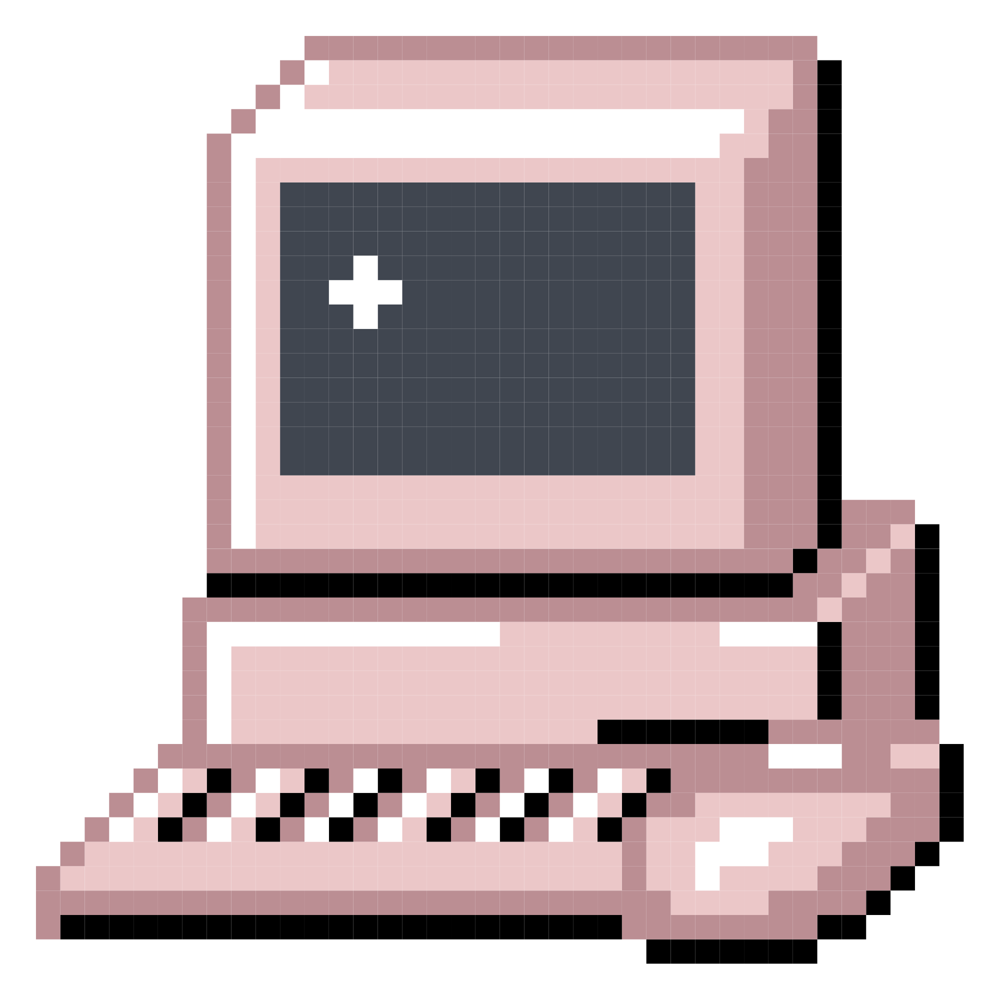
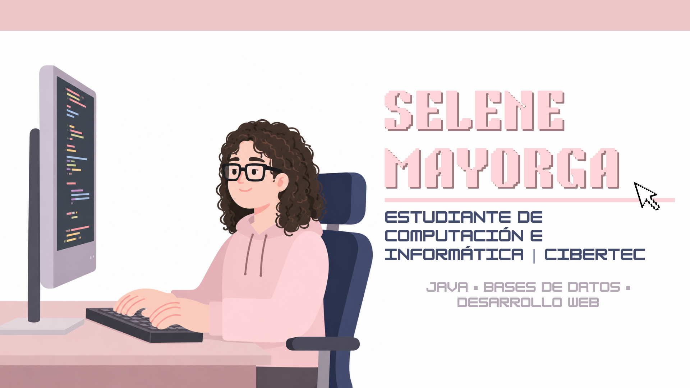

<h1>

Hola, soy Selene 👋
</h1>

Estudiante de Computación e Informática en Cibertec, actualmente cursando el tercer ciclo de la carrera.

  

⭐ Me encuentro desarrollando mis habilidades en programación, bases de datos y desarrollo web, con interés en la creación de soluciones tecnológicas que aporten valor a las personas y organizaciones.

### Tecnologías y herramientas

* Java
* SQL
* PostgreSQL
* HTML
* CSS
* Git y GitHub

### Actualmente aprendiendo

* Desarrollo de aplicaciones web
* Modelado y gestión de bases de datos
* Buenas prácticas de programación
* Control de versiones con Git

### Objetivos

Busco seguir adquiriendo experiencia mediante proyectos académicos y prácticas preprofesionales que me permitan fortalecer mis conocimientos técnicos y crecer profesionalmente en el área de desarrollo de software.

### Contacto

📍 Lima, Perú

📧 Correo: selenemayorga62@gmail.com
